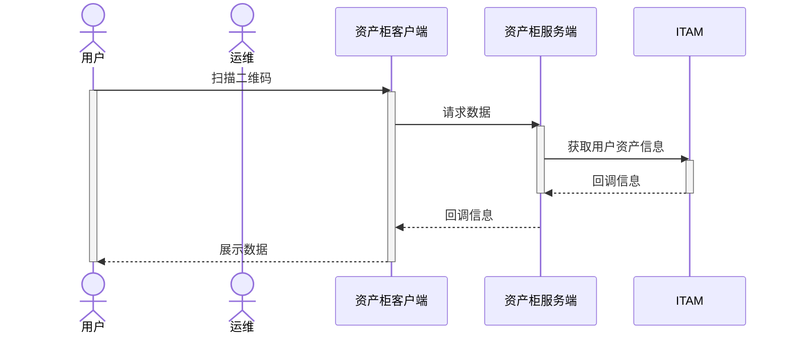
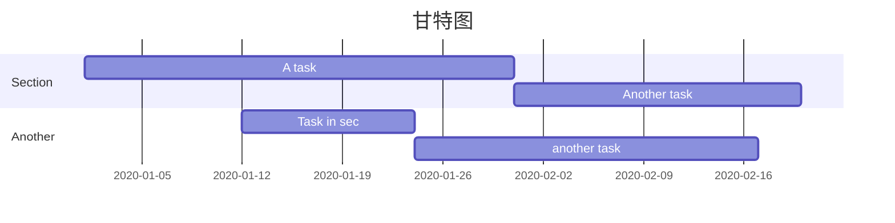

plantuml：https://plantuml.com/zh/sequence-diagram

常用代码：https://juejin.cn/post/6844903839351455752

流程介绍：https://www.cnblogs.com/GuoYuying/p/14789182.html#3

Typora 绘图：https://zhuanlan.zhihu.com/p/172635547

IDEA 绘图：https://cloud.tencent.com/developer/article/1927441

